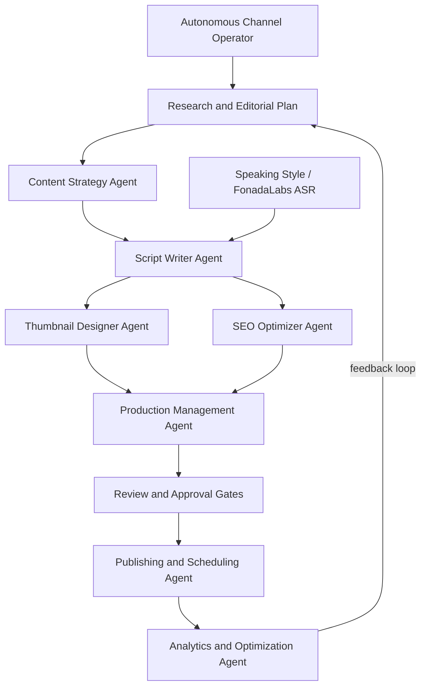
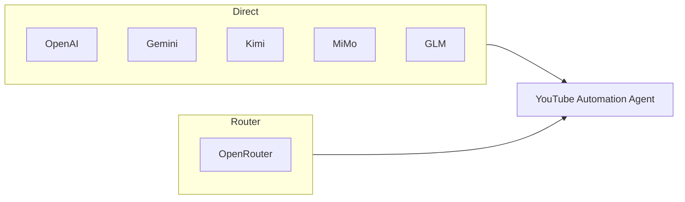
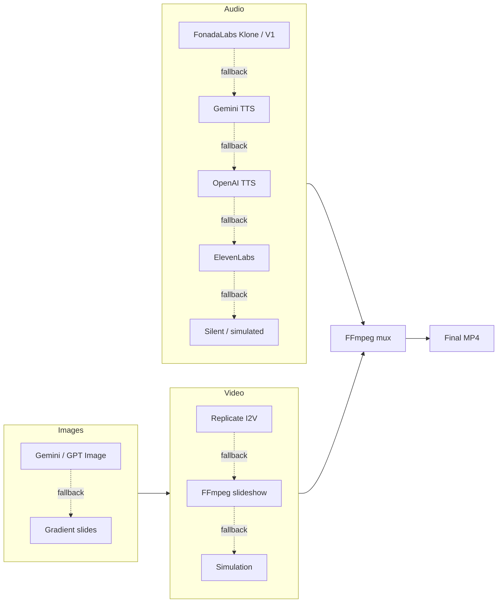

# YouTube Automation Agent - FonadaLabs Version

**The open-source AI agent that runs a YouTube channel end to end.**

Research topics → write scripts → generate narration and visuals → assemble videos → optimize metadata → review → schedule → publish → learn from analytics.

[](https://github.com/darkzOGx/youtube-automation-agent/actions/workflows/ci.yml)
[](LICENSE)
[](package.json)

## What's new

Recent operator work on top of **v2.6.0**:

- **Speaking style:** a dedicated dashboard page. Paste up to 5 YouTube links; FonadaLabs ASR transcribes them and the next AI scripts follow that delivery. This does not clone a voice.
- **YouTube from the dashboard:** save a Google OAuth client and sign in under **Channel setup**. Generation still works without YouTube.
- **FonadaLabs narration:** Klone V2 with a `share_id`, or a named V1 voice. Spoken language (Hindi, English, Tamil, Telugu) is a dashboard control, not a hidden `.env` default.
- **Video length matches narration:** slideshows are timed from the real TTS audio. Mux does not cut the track with FFmpeg `-shortest`.
- **Safer open-source checkout:** `.env`, OAuth tokens, SQLite, and generated media are gitignored. Copy `.env.example` to `.env`.

Version 2.6 also added the Autonomous Channel Operator, closed-loop learning, the Production Readiness Gate, and packaging experiments. Full history: [CHANGELOG.md](CHANGELOG.md).

- **Self-hosted:** credentials, media, and channel data stay on your machine.
- **Approval-first:** nothing is scheduled until quality, rights, and human-review gates pass by default.
- **Strategy-driven:** set an objective, audience, pillars, cadence, and guardrails; the agent turns them into researched plans and production runs.
- **Provider-flexible:** Gemini, OpenAI, OpenRouter, Kimi, MiMo, GLM, or another OpenAI-compatible endpoint.
- **Observable:** follow jobs, failures, review, publishing, and local activation milestones in the dashboard.

## Quick start

```bash
git clone https://github.com/darkzOGx/youtube-automation-agent.git
cd youtube-automation-agent
cp .env.example .env
npm install
npm run walkthrough
npm start
```

Open [http://localhost:3456](http://localhost:3456). The walkthrough explains each provider, tests credentials, and can start YouTube authorization.

Already set up? Put keys in `.env`, then `npm start`. `npm run setup` is a shorter classic flow. Every setting is documented in [`.env.example`](.env.example).

YouTube OAuth is **not** an API key in `.env`. Connect it in the dashboard. Full walkthrough: [docs/youtube-oauth.md](docs/youtube-oauth.md). FonadaLabs keys and share ids: [docs/fonada-credentials.md](docs/fonada-credentials.md).

### What you need

- Node.js 18+
- At least one AI text provider key
- FFmpeg (installed automatically via `ffmpeg-static`, or set `FFMPEG_PATH`)
- Optional for upload: a Google account and YouTube Data API OAuth client
- Optional for FonadaLabs TTS / speaking style: a [FonadaLabs](https://fonada.ai) API key; `yt-dlp` on `PATH` (or `YT_DLP_PATH`) to pull audio from YouTube links

Gemini offers free access for supported text and TTS. Gemini AI image generation currently needs paid-tier access. Without an image provider, Lumen can assemble gradient-based visuals.

## Dashboard

The left nav stays on screen while the main pane scrolls.

| Page | Purpose |
| --- | --- |
| **Overview** | Decision queue, running jobs, upcoming schedule, activity |
| **Autonomous operator** | Channel mandate, activate/pause runs |
| **Pipeline** | Every production: review, reject, retry, open Review Studio |
| **Calendar & ideas** | Scheduled publishes and a topic backlog |
| **Analytics** | Performance plus **What the agent learned** |
| **Production readiness** | Live probes before you turn on autonomy |
| **Speaking style** | Learn delivery from YouTube videos; toggle use on next scripts |
| **Channel setup** | YouTube OAuth, brand, language, voice / share id, timezone |

**Create video** starts a background generation job (topic optional). You can follow stages and cancel between them.

## Channel setup

Guardrails on this page apply to every later job:

- Channel name, goal, audience, brand voice, CTA, visual direction
- Default format (explainer, tutorial, list, review, story)
- Spoken language: Hindi, English, Tamil, Telugu
- Voice or FonadaLabs `share_id` (6–12 alphanumeric → Klone V2; a name → V1; blank → `FONADA_SHARE_ID` in `.env`)
- Timezone used for schedule display and `datetime-local` (India IST is `Asia/Kolkata`)
- Blocked topics (quality review rejects matches)
- Require approval before scheduling

### Connect YouTube

Step-by-step Cloud Console + dashboard flow: **[docs/youtube-oauth.md](docs/youtube-oauth.md)**.

Uploads use OAuth, not a YouTube API key.

1. In [Google Cloud Console](https://console.cloud.google.com/apis/credentials), create a project.
2. Enable **YouTube Data API v3**.
3. OAuth consent screen: **External**. Add your Gmail as a **test user** or you will get `403 access_denied`.
4. Create an OAuth client of type **Desktop app**.
5. In **Channel setup**, paste Client ID and Client Secret, save, then **Connect Google account**.
6. Allow this redirect URI (the dashboard shows the exact value):

   `http://127.0.0.1:3456/api/youtube/callback`

Google may say the app is not verified. That is expected for a local Desktop client — use Continue / Advanced.

Tokens are stored in `config/tokens.json` (gitignored). You can also keep the client in `config/credentials.json` from [`config/credentials.example.json`](config/credentials.example.json).

Generation, review, and local export work without YouTube. Connect it when you want the publisher to upload.

Custom thumbnails and captions need extra YouTube scopes / channel permissions. If those fail after a successful upload, the video is still on the channel.

## Speaking style

**Speaking style** is its own page (`#style`). It does **not** clone anyone’s voice. It only shapes the **written script**.

1. Paste 1–5 YouTube URLs (your videos or references).
2. Set **Spoken language for ASR** to the language actually spoken. English audio with Hindi ASR produces English sounds written in Devanagari.
3. Click **Learn speaking style**. The job transcribes the first 8 minutes of each video (`SPEAKING_STYLE_MAX_MINUTES`).
4. Leave **Use this style in the next scripts** on.

The profile (opening, rhythm, energy, vocabulary, CTA, excerpts) is stored locally. Manual **Create video** and autonomous script jobs attach it to the script-writer prompt. Already-rendered videos are unchanged. If AI script writing falls back to templates, the style block is not applied.

Expect roughly 2–4 minutes per video, often 10–20 minutes for five links. Downloads time out if YouTube/yt-dlp stalls.

CLI: `npm run test:fonada-asr` with links and `FONADA_API_KEY` set.

## Voice and video assembly

FonadaLabs API key, `share_id` vs voice name, and ASR: **[docs/fonada-credentials.md](docs/fonada-credentials.md)**.

Narration order: **FonadaLabs** (Klone V2 or V1) → Gemini TTS → OpenAI TTS → ElevenLabs → Azure → silent/simulated.

Slideshows:

- Spoken script text (including array bullets) drives slides.
- Final duration follows the narration file plus a short buffer.
- Last slide absorbs leftover time; if video is shorter than audio, the last frame is frozen.
- Mux does **not** use `-shortest`, so a long TTS track is not cut to a short slideshow.

Finished files land in `data/videos/` on this machine. They are not uploaded until you approve and the schedule runs.

## Verify production readiness

Before autonomous production, open **Production readiness** and **Run verified check**. The gate makes small live text and narration requests, verifies the connected YouTube channel, builds and decodes a temporary MP4, and validates queued upload metadata. It never uploads to YouTube. Temporary probe files are deleted afterward.

AI image generation can cost more, so its live probe is an opt-in checkbox. Without it, image setup is reported as verified, skipped, or using the gradient fallback.

Results persist in SQLite with remediation steps. A recorded blocking failure stops autonomous generation and publishing until a later run passes. Manual work still works if readiness was never checked or the last result is older than 24 hours.

## Autonomous Channel Operator

Open **Autonomous operator** and describe the channel outcome. Set objective, audience, pillars, cadence, success metric, and boundaries, then **Activate & run now**.

Lumen refreshes trend and competitor signals, checks recent topics, builds an evidence-labeled plan, and runs each video through strategy, script, thumbnail, SEO, production, and workflow. Active strategies also drive the scheduled daily generation check. Runs stay visible in the dashboard.

Finished videos still wait for factual review, media-rights confirmation, and approval. Autonomy does not skip those gates. Simulated videos cannot publish.

## Close the performance loop

After publication, Lumen stores 24-hour and 7-day snapshots (CTR, retention, engagement, watch time, format, length, hook, title) against **this channel’s** history.

**Analytics → What the agent learned** shows evidence and confidence. Pending or rejected recommendations never affect generation. An approved one becomes a planning constraint on the next operator run. Simulated analytics are unverified and never become baselines.

Approved packaging learnings can produce title and thumbnail variants for **new** videos. Review Studio is the only place a variant is chosen. Live YouTube metadata is not silently rewritten.

## From idea to published video

| Stage | What Lumen does | What you control |
| --- | --- | --- |
| Research | Finds topics and builds a strategy | Niche, audience, blocked topics |
| Script | Writes hook, narrative, CTA, metadata; optional speaking-style prompt | Voice / share id, format, length, language, brand |
| Production | Narration, visuals, captions, real MP4 | Providers and fallbacks |
| Review | Quality checks and Review Studio | Facts, rights, edits, approval |
| Publish | Cron uploads approved items when the slot is due | Privacy, time, final decision |
| Learn | 24h / 7d evidence and recommendations | Approve or reject each learning |

Lumen distinguishes a real MP4 from a simulated placeholder. Simulated output cannot be approved or published.

## Architecture



| Agent | Role |
| --- | --- |
| **Content Strategy** | Trends, topics, calendar |
| **Script Writer** | Hooks, structure, CTAs, speaking-style prompt |
| **Thumbnail Designer** | Thumbnails and A/B variants |
| **SEO Optimizer** | Titles, descriptions, tags |
| **Production** | TTS, images, FFmpeg assembly |
| **Publishing** | Queue, upload, schedule |
| **Analytics** | Performance back into strategy |

## AI providers

All OpenAI-compatible providers work out of the box. The SDK base URL is configured automatically. Use OpenRouter if you want one key for many models.



| Provider | Models | Base URL | Cost |
| --- | --- | --- | --- |
| **OpenAI** | GPT-5.6 family | `api.openai.com/v1` | provider pricing |
| **OpenRouter** | 400+ models | `openrouter.ai/api/v1` | varies |
| **Google Gemini** | 3.7 Flash, 3.1 Pro Preview, 3.5 Flash-Lite | `@google/genai` | free tiers vary |
| **Kimi (Moonshot AI)** | Kimi K3, K2.7 Code, K2.6 | `api.moonshot.ai/v1` | provider pricing |
| **MiMo (Xiaomi)** | MiMo V2.5 Pro, V2.5 | `api.xiaomimimo.com/v1` | provider pricing |
| **GLM (Zhipu AI)** | GLM-5.3, 5.2, 5.1 | `api.z.ai/api/paas/v4/` | provider pricing |

Also used when configured: FonadaLabs (TTS + ASR), Gemini images/TTS, ElevenLabs, Azure Speech, Replicate video, Anthropic-compatible endpoints, Ollama / any OpenAI-compatible URL.

## Configuration

| Guide | Contents |
| --- | --- |
| [docs/fonada-credentials.md](docs/fonada-credentials.md) | FonadaLabs API key, Klone `share_id`, V1 voices, ASR |
| [docs/youtube-oauth.md](docs/youtube-oauth.md) | Google Cloud project, consent screen, Desktop client, dashboard connect |
| [`.env.example`](.env.example) | Every environment variable |

### Environment

```bash
cp .env.example .env
```

[`.env.example`](.env.example) is the full list. Secrets stay commented so they cannot be copied by accident.

| Group | Variables |
| --- | --- |
| App | `PORT`, `NODE_ENV`, `LOG_LEVEL`, `API_KEY`, `MAX_CONCURRENT_JOBS` |
| Channel | `CHANNEL_NAME`, `CHANNEL_TIMEZONE`, `YOUTUBE_REGION`, `DEFAULT_PRIVACY_STATUS` |
| Text | `OPENAI_API_KEY`, `OPENROUTER_API_KEY`, `GEMINI_API_KEY`, `MOONSHOT_API_KEY`, `MIMO_API_KEY`, `GLM_API_KEY` |
| FonadaLabs / style | `FONADA_API_KEY`, `FONADA_SHARE_ID`, `FONADA_VOICE`, `FONADA_TTS_MODEL`, `SPEAKING_STYLE_MAX_MINUTES` |
| Optional media | `FFMPEG_PATH`, `YT_DLP_PATH`, `YT_DLP_COOKIES`, Gemini/ElevenLabs/Replicate/Azure keys |

Do not put Google Client ID/Secret in `.env`. Use Channel setup or `config/credentials.json`.

### API keys (text)

| Provider | Where to get a key | Env var |
| --- | --- | --- |
| OpenAI | [platform.openai.com](https://platform.openai.com/) | `OPENAI_API_KEY` |
| OpenRouter | [openrouter.ai/keys](https://openrouter.ai/keys) | `OPENROUTER_API_KEY` |
| Gemini | [Google AI Studio](https://aistudio.google.com/) | `GEMINI_API_KEY` |
| Kimi | [platform.kimi.ai](https://platform.kimi.ai) | `MOONSHOT_API_KEY` |
| MiMo | [mimo.mi.com](https://mimo.mi.com) | `MIMO_API_KEY` |
| GLM | [z.ai](https://z.ai) | `GLM_API_KEY` |
| FonadaLabs | [fonada.ai](https://fonada.ai) | `FONADA_API_KEY` |

### Activation measurement and privacy

The dashboard computes setup, first-real-MP4, approval, publication, and repeat-generation milestones from local SQLite and files. A video counts only when a non-simulated `.mp4` with an MP4 signature still exists.

Anonymous milestone reporting is off by default. It turns on only if you set both telemetry variables. The payload is milestone name and time, Lumen version, OS family, Node major, and a random install ID. It never includes keys, channel data, prompts, titles, or files.

## Automation and publishing

After `npm start`:

- Daily content generation around 06:00 (uses the active strategy cadence when one exists)
- Publish queue **every 15 minutes** (not at the exact minute you typed)
- Analytics around 09:00
- Optimization around 22:00
- Weekly strategy review on Sundays

Times are interpreted with the channel timezone. Stored timestamps are UTC.

Default privacy is `private` (`DEFAULT_PRIVACY_STATUS`). A successful upload may still be invisible on the public channel until you change privacy in YouTube Studio.

YouTube only accepts `publishAt` when that timestamp is still in the future. The publisher runs after your slot is due, so a past `publishAt` can fail with **invalid scheduled publishing time**. Retry on the next 15-minute tick, or upload immediately without a past schedule. If a video is already on YouTube, Studio is the source of truth.

## API

Mutating routes need header `x-api-key` when `API_KEY` is set in `.env`.

```bash
# health
curl http://localhost:3456/health

# generate (topic optional)
curl -X POST http://localhost:3456/generate \
  -H "Content-Type: application/json" \
  -H "x-api-key: $API_KEY" \
  -d '{"topic":"Top 10 Life Hacks","style":"list","length":"medium","language":"en"}'

curl http://localhost:3456/api/jobs/:jobId
curl http://localhost:3456/api/dashboard
curl http://localhost:3456/schedule
curl http://localhost:3456/analytics

# readiness
curl http://localhost:3456/api/readiness
curl -X POST http://localhost:3456/api/readiness/run \
  -H "Content-Type: application/json" \
  -H "x-api-key: $API_KEY" \
  -d '{"includePaidMedia":false}'

# YouTube (dashboard equivalents)
curl http://localhost:3456/api/youtube
curl -X PUT http://localhost:3456/api/youtube \
  -H "Content-Type: application/json" \
  -H "x-api-key: $API_KEY" \
  -d '{"clientId":"...apps.googleusercontent.com","clientSecret":"..."}'
curl -X POST http://localhost:3456/api/youtube/connect \
  -H "x-api-key: $API_KEY"

# speaking style
curl http://localhost:3456/api/speaking-style
curl -X POST http://localhost:3456/api/speaking-style/learn \
  -H "Content-Type: application/json" \
  -H "x-api-key: $API_KEY" \
  -d '{"urls":["https://www.youtube.com/watch?v=XXXXXXXXXXX"],"language":"en"}'
curl -X PUT http://localhost:3456/api/speaking-style \
  -H "Content-Type: application/json" \
  -H "x-api-key: $API_KEY" \
  -d '{"enabled":true}'

# operator
curl -X PUT http://localhost:3456/api/operator/strategy \
  -H "Content-Type: application/json" \
  -H "x-api-key: $API_KEY" \
  -d '{"objective":"Own practical AI automation for small teams","audience":"Small business operators","contentPillars":["AI workflows","Automation playbooks"],"cadencePerWeek":2,"videosPerRun":2,"defaultFormat":"tutorial","defaultLength":"medium","status":"draft"}'
curl -X POST http://localhost:3456/api/operator/start \
  -H "Content-Type: application/json" \
  -H "x-api-key: $API_KEY" \
  -d '{}'

# review
curl http://localhost:3456/api/content/:contentId
curl -X POST http://localhost:3456/api/content/:contentId/approve \
  -H "Content-Type: application/json" \
  -H "x-api-key: $API_KEY" \
  -d '{"privacyStatus":"private","factChecked":true,"rightsConfirmed":true}'
```

## Production pipeline



If a paid key is missing, that stage degrades and the rest of the pipeline still runs. Startup prints a capability check (script, images, TTS, FFmpeg, YouTube).

## Project structure

```
youtube-automation-agent/
├── agents/           # one file per pipeline agent
├── config/           # credentials.example.json; local credentials.json + tokens.json are gitignored
├── dashboard/        # operator console (HTML/CSS/JS)
├── docs/             # FonadaLabs and YouTube OAuth setup guides
├── database/         # SQLite schema and access
├── data/             # generated media and DB (gitignored except .gitkeep)
├── schedules/        # cron automation
├── scripts/          # FonadaLabs TTS/ASR tests, growth snapshots
├── utils/            # TTS, ASR, FFmpeg, speaking style, credentials
├── .env.example      # copy to .env
├── .github/          # CI
└── index.js          # Express server + agent init
```

Do not commit `.env`, `config/credentials.json`, `config/tokens.json`, `*.db`, or files under `data/videos`, `data/scripts`, `data/audio`, `data/captions`. Those are operator-specific.

## Troubleshooting

| Problem | Fix |
| --- | --- |
| `Missing credentials for: an AI provider` | Set any text key in `.env` or run `npm run credentials:setup` |
| `'ffmpeg' is not recognized` / no MP4 | `npm install`, or install FFmpeg and set `FFMPEG_PATH` |
| Video marked `simulated` | Read the startup capability check; a key or FFmpeg is missing |
| Dashboard **connection refused** | Run `npm start` in this folder; open `http://localhost:3456` |
| `403 access_denied` on Google sign-in | Add your Gmail as an OAuth **test user** |
| Speaking style stuck on Learning | Check `yt-dlp`, network, and FonadaLabs key; a stuck job times out and can be retried |
| ASR text is English in Hindi script | Set ASR language to the language actually spoken |
| Next scripts ignore speaking style | Confirm status is **Learned**, the toggle is on, and the job used the AI script writer |
| Publish queue runs but YouTube says **invalid scheduled publishing time** | The slot is already past; YouTube rejects `publishAt` in the past. Wait for the next 15-minute tick or upload without a past schedule |
| Uploaded but not on the channel | Default privacy is **private** — check YouTube Studio |
| Thumbnail / captions fail after upload | Channel lacks custom thumbnail or caption scopes; the video can still be live |
| YouTube quota exceeded | Google Cloud quotas; post less often |
| Generation failed | Keys, credits, and `logs/` |

```bash
NODE_ENV=development DEBUG_MODE=true npm start
```

## Extending

### Custom AI provider

```javascript
// utils/ai-service.js
const Anthropic = require('@anthropic-ai/sdk');

class ClaudeAIService {
  constructor(apiKey) {
    this.client = new Anthropic({ apiKey });
  }
  async generateContent(prompt) {
    const message = await this.client.messages.create({
      model: 'claude-fable-5',
      max_tokens: 1024,
      messages: [{ role: 'user', content: prompt }]
    });
    return message.content[0].text;
  }
}
```

### Custom content types

```javascript
// agents/content-strategy-agent.js
const contentTypes = {
  podcast: {
    duration: '10-15 minutes',
    style: 'conversational',
    thumbnail: 'podcast-style'
  }
};
```

## More tools by darkzOGx

- [darkzloop](https://github.com/darkzOGx/darkzloop) — terminal agent runner
- [darkzBOX](https://github.com/darkzOGx/darkzBOX) — open-source Instantly.ai-style email
- [open-sales-researcher](https://github.com/darkzOGx/open-sales-researcher) — B2B research for Claude Code, Cursor, Copilot
- [darkzseo](https://github.com/darkzOGx/darkzseo) — SEO tooling

## Built by

[@darkzOGx](https://github.com/darkzOGx). [X](https://x.com/darkzOGx) · [laderalabs.io](https://laderalabs.io)

If Lumen saves you time, a star helps it reach more operators.

## Contributing

See [CONTRIBUTING.md](CONTRIBUTING.md). One focused concern per PR, no lockfile churn, lint + tests must pass. Questions: [Discussions](https://github.com/darkzOGx/youtube-automation-agent/discussions). Issues are for bugs.

```bash
git clone <your-fork>
cd youtube-automation-agent
npm install
npm run lint
npm test
```

## License

MIT — [LICENSE](LICENSE).

## Acknowledgments

- [OpenAI](https://openai.com/) — GPT-5.6, GPT Image, TTS
- [OpenRouter](https://openrouter.ai/) — unified multi-model API
- [Google](https://ai.google.dev/) — Gemini text, image, TTS
- [Google Cloud](https://console.cloud.google.com/) — YouTube Data API
- [FonadaLabs](https://fonada.ai/) — multilingual TTS and ASR
- [Moonshot AI](https://www.moonshot.ai/) — Kimi
- [Xiaomi](https://mimo.mi.com/) — MiMo
- [Zhipu AI](https://z.ai/) — GLM
- [ElevenLabs](https://elevenlabs.io/) — TTS fallback
- [Replicate](https://replicate.com/) — optional video generation
- [ConstructionBids.ai](https://constructionbids.ai) — public-works bid matching

---

This tool is for legitimate content creation. Follow [YouTube’s Terms of Service](https://www.youtube.com/t/terms) and Community Guidelines. Speaking style learns writing patterns from public videos; it does not download or republish those videos, and it does not clone a voice.
